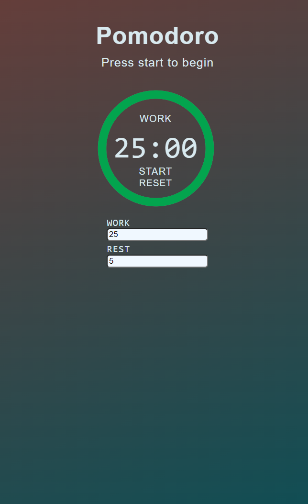
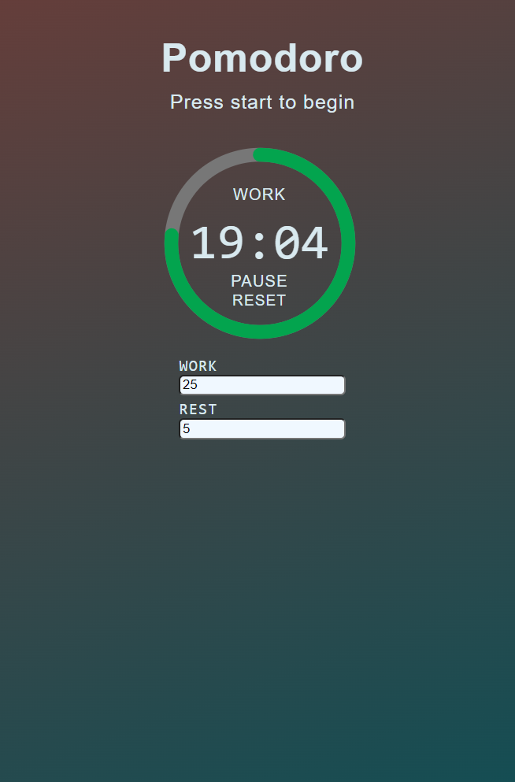

# Pomodoro-App

A simple pomodoro counter to help measure focus and rest time.
I created it as a learning project, to help me understand concepts like web-components and the pub-sub pattern.

  
  

# Pomodoro Technique

Pomodoro is a time management technique consisting in break work in intervals.
Typically 25 minutes with breaks of 5-10 minutes.

# Curiosities

Pomodoro is the italian word for tomato, the technique received this name after the kitchen counter the Francesco Cirillo used as student.

